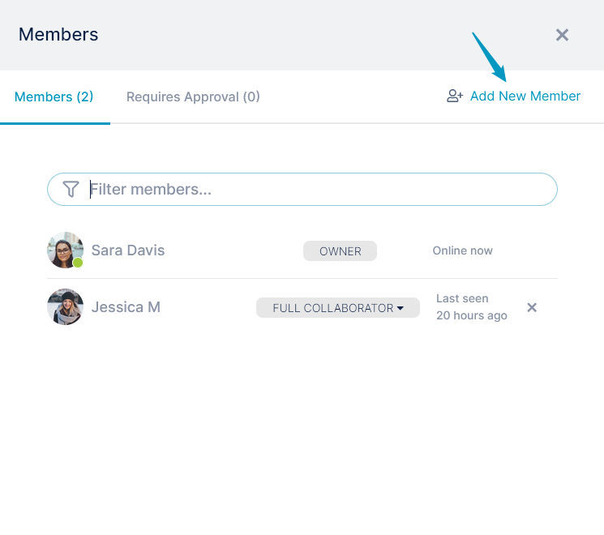
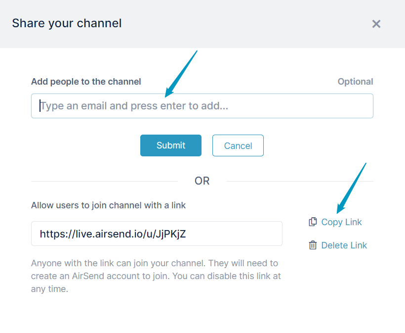
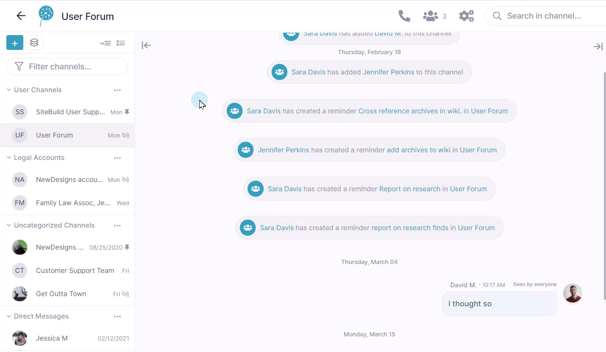

# AirSend Channels

AirSend channels are the places where you collaborate with clients or team members by exchanging messages, sharing files, assigning tasks, organizing files, and saving notes. 

## Creating an AirSend channel

You can create an AirSend channel in a few simple steps.

This video shows you how.

<video src="../assets/airsend-channels/create-a-channel.mp4" controls muted></video>

1. Open AirSend, and click the **Create New Channel** icon.
2. Enter a channel name and any number of members.
3. Click **Create Channel**.

That's it. You're ready to go!

Now you can begin sending messages, sharing files, and assigning tasks.

## You can add more members at any time

1. Click the members icon at the top of the channel.

2. Click **Add New Member**.

The **Share Your Channel** dialog box opens.
It enables you to either add users directly to your channel or to copy a link and send it to users to give them the option of joining.

**To do more with members, see:**

- [Approving members]()
- [Removing a member from a channel]()
- [Changing a Member's Type]()

## Quickly Shifting Between Channels 

When you are working within a channel in AirSend, all other channels that you have created or are a member of appear in the left channel sidebar. To move to another channel, simply click it in the channel sidebar:

The channel sidebar enables you to organize your channels so you can find them easily. See [Channel Sidebar: Finding Channels]() for help.

::: tip Member types
In AirSend, there are different member types. Channel creators are Owners with full privileges, and other members are Full Contributors or Viewers by default. Additional member types can be assigned to give channel users increased privileges.

For more information, see [Member types]().
:::

::: info Public channels
If you post the channel link to make it available to all users, it is a [public channel](), and you may require that users request membership before joining.
:::