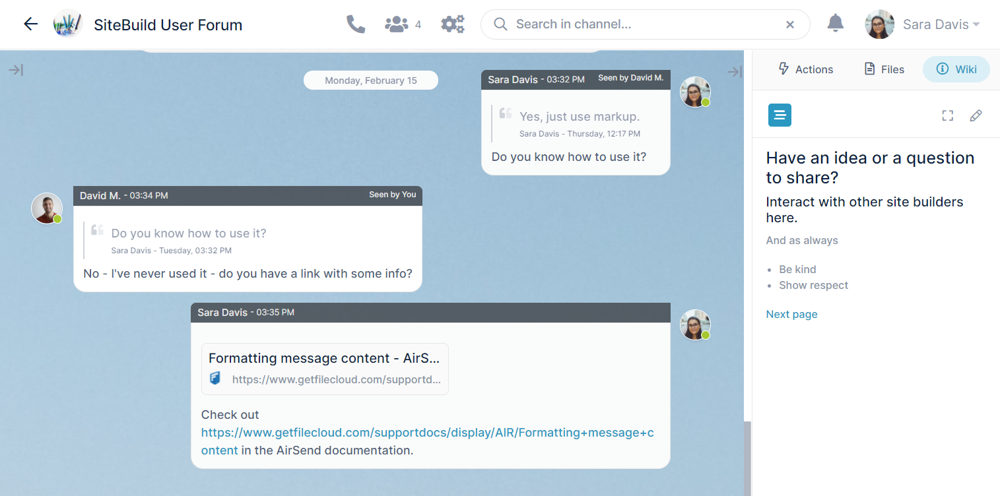
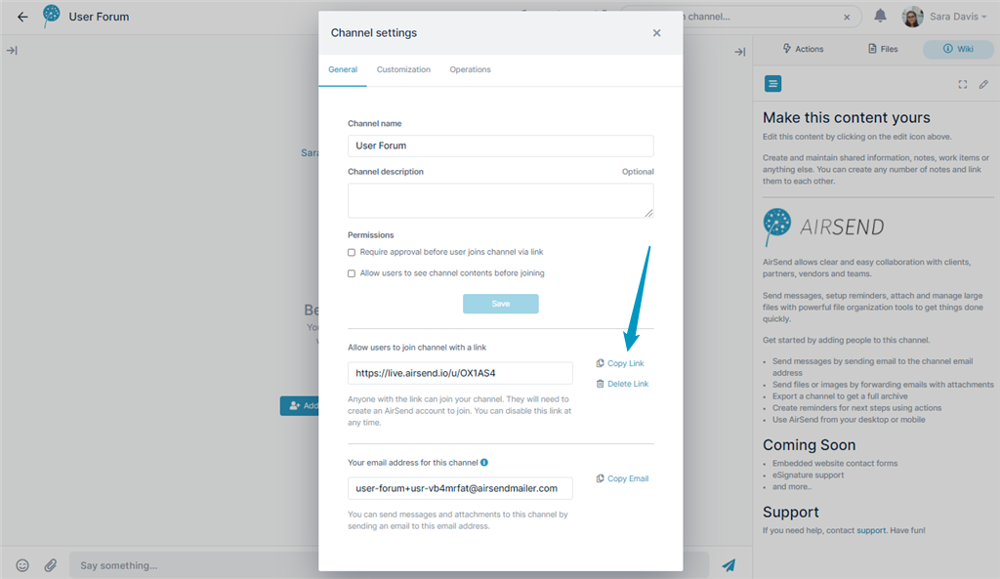
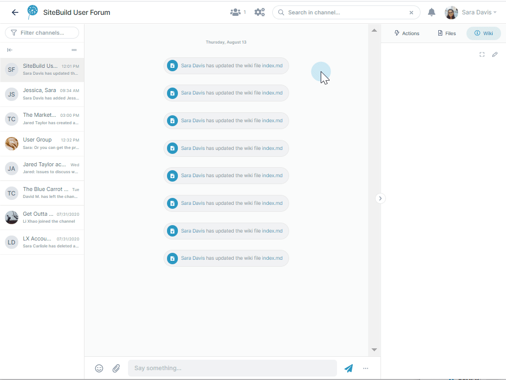

# Public channels

Use public channels to create public chat rooms for your business or personal interests.

## Create a public channel

Begin creating a public channel the same way you create other [AirSend channels](./airsend-channels.md). Play the following video to see how.

<video src="../assets/public-channels/create-public-channel.mp4" controls muted></video>

You can copy the link after the channel is created by clicking the settings icon in the channel, and in the General tab, clicking **Copy Link** next to the channel link.

**Note:** When a user joins a public channel, by default, they are a **Contributor** member, which means they have all the same privileges as a **Full contributor**, but they cannot edit the wiki or add files. 

## Adding style to your public channel

Although you are not required to customize a public channel, you can increase its appeal and engage users by inserting background and logo images and adding a description and guidelines. Watch this video to see how.

When you're ready, publish the channel's link on your company website or a site popular with target members.