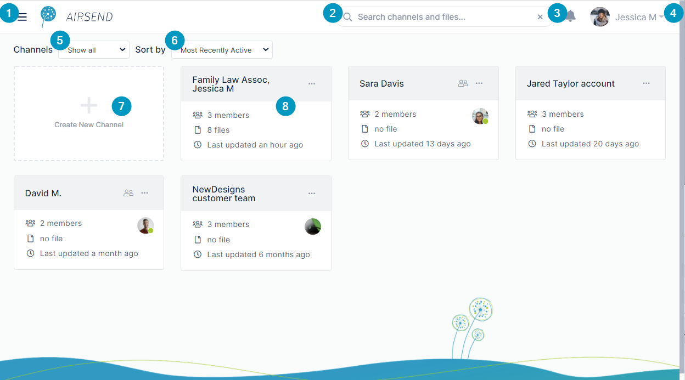
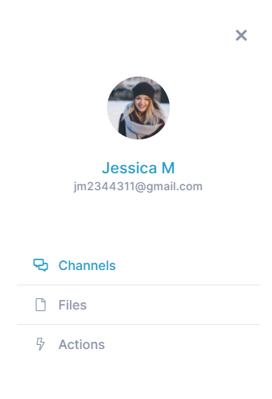
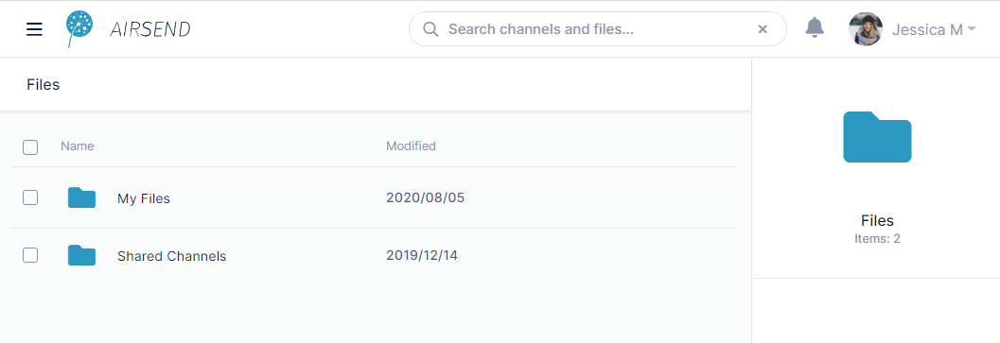
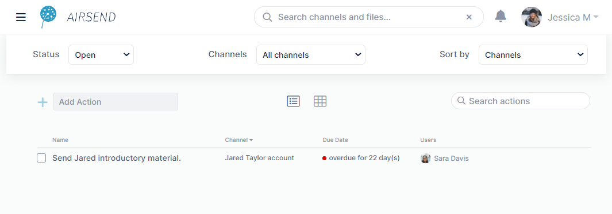

# AirSend Dashboard

### The AirSend dashboard

When you sign in to AirSend, the first screen that opens is the AirSend dashboard. 

The first time you log in to AirSend, your dashboard looks like this:

1.  **Triple-bar icon** - Click this icon to open the dashboard side navigation panel:  
      
    This panel displays the links **Channels**, **Files**, and **Actions**. When **Channels** is clicked, the Dashboard view to the left, which displays boxes with each of the user's channels, appears.  
      
    When **Files** is clicked, [Files view](/files/files-view) for all channels opens:  
      
      
    When **Actions** is clicked, [Actions view](/actions/intro) for all actions opens:  
      
      
    
2.  **Search box**. Enter a search term to locate matching content in channels, messages, actions, files, and users. See [Search in AirSend](/using-airsend/search-in-airsend).
3.  **Notifications**. This icon displays the number of unread notifications. Clicking it displays the notifications. See [Notifications in AirSend](/notifications).
4.  **User** signed in to the channel, in this case, **Jessica M**. Click the down arrow to see a user menu. For more information, see [Settings in AirSend](/account/settings-in-airsend).
5.  **Channels**. Appears if the user is a member of at least one channel. Choices are:
    *   **Show All**
    *   **Show Active** (default)
    *   **Show Closed**
6.  **Sort by -** Appears if the user is a  member of at least one channel. Options for sorting channels on the dashboard. Choices are:
    *   **Most recently active** (default)
    *   **Least recently active**
    *   **New channels**
    *   **Old channels**
7.  **Create New Channel** \- Click this image to [create a new channel](/channels/creating-a-channel).
8.  **Channel** - Each channel is represented by a card that displays number of members, number of attached files, and last update date/time, Click the More options icon (3 dots) to perform channel actions such as delete, close, and copy. For more information, see [Channel settings for a channel owner](/channels/channel-settings-for-a-channel-owner).