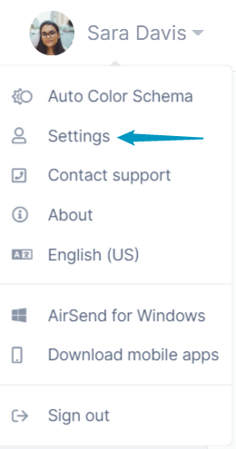
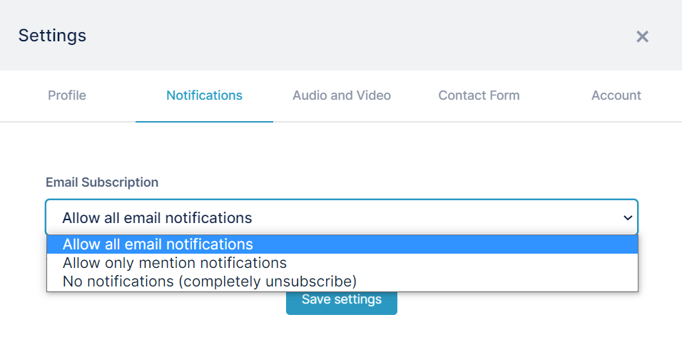
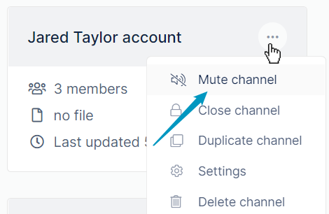
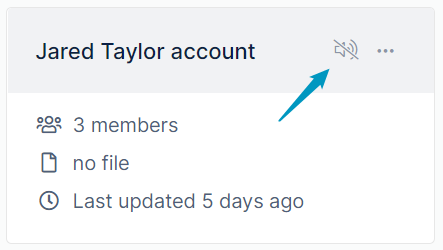

# Changing notification settings

In AirSend, you can choose how often you want to receive notifications or turn notifications off.

## Change or turn off email notifications

By default, you receive all email notifications when an activity happens in a channel.  
  
To change the frequency of email notifications from all channels:

1.  In the upper-right corner of your screen, click your username, and then click settings.  
    
2.  In the Settings dialog box, click Notifications, and then choose one of the Email subscription settings:
    -   **Allow all email notifications**.
    -   **Allow only mention notifications** - You are only notified by email if you are mentioned (using @yourusername or @all in a message, or if an action is assigned to you). 
    -   **No notifications (completely unsubscribe)** - You do not receive email notifications about anything happening in a channel.  
        

## Mute a channel 

Muting a channel enables you to turn off messages and alerts for that channel only. When you mute a channel, you no longer receive email notifications or see alerts or push notifications about actions and new messages in the channel. Instead of the overlay showing the number of uncounted messages in the channel, you see the muted channel icon.

You can mute a channel from the dasboard by clicking the three dots on the channel and choosing **Mute channel**.  
  

If no other symbols appear on the channel icon, a mute symbol appears to indicate that the channel is muted:  
  

You can also mute it from the left navigation pane while you are within a channel.