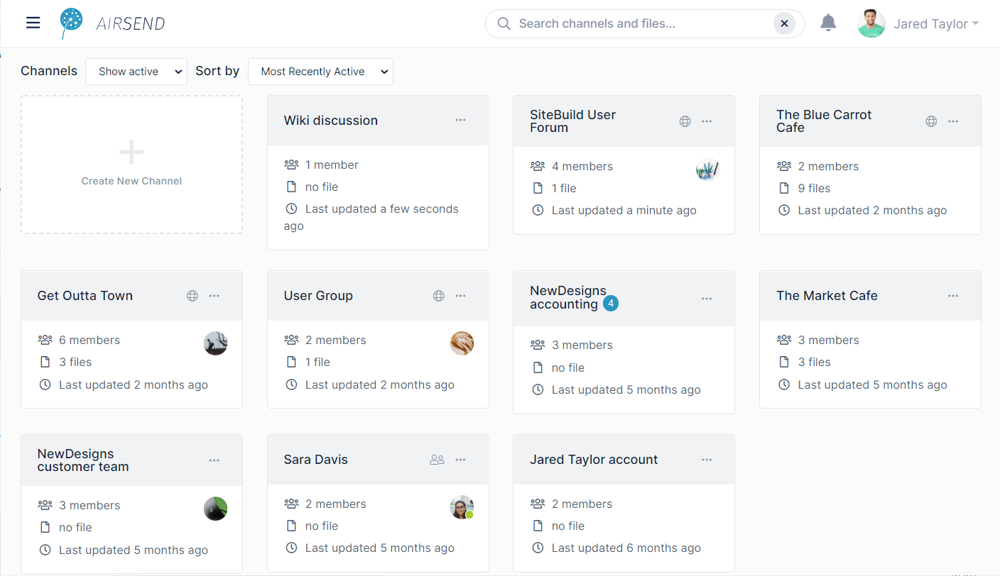

# Search in AirSend

## Content search

AirSend's content search is active in the dashboard and inside channels. The content search returns matching content in the following categories:

-   channel names
-   messages
-   files
-   actions
-   user names

When you search in the dashboard, you find matching content in all channels; when you search in a channel, you find matching content within that channel only.

As you type into the search box, AirSend displays up to three matches per category under the search box. To see all matches, click **Enter** or click **Show All** for one of the search categories.

