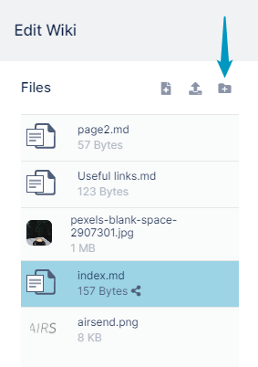

# Adding a Folder to a Wiki

AirSend lets you create new folders during wiki editing so you can store wiki files in an organized manner.

**To create a new folder:**

1.  [Open the wiki editor](/wiki/intro).  
    
2.  In the Files panel on the left of the Wiki editor, click the **Create a folder** button.  
    
3.  An **Add Folder** dialog box opens. 
4.  Enter a folder name.  
    
5.  Click **Create Folder**.  
    The folder appears in the Files panel.
6.  Drag and drop files into the folder, or click on the folder to open it and upload files into it.  
    