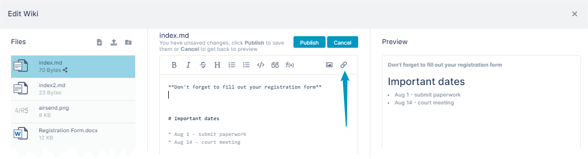
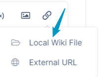
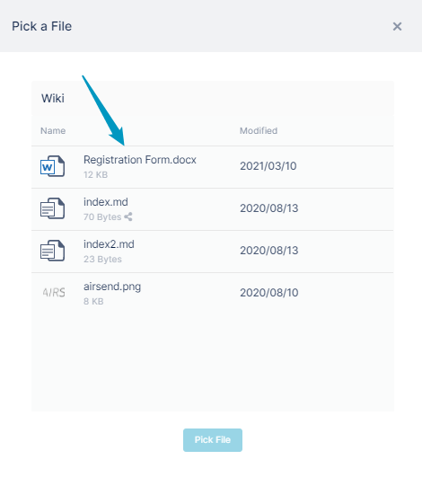
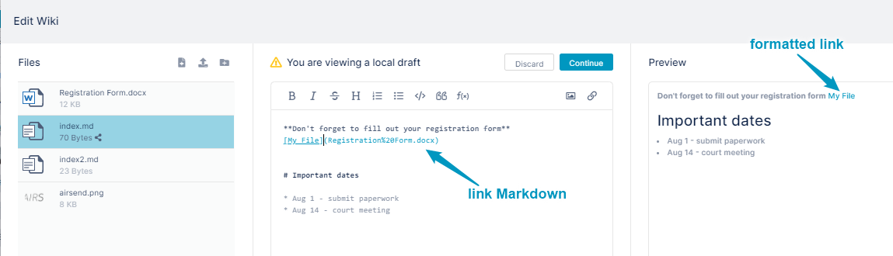

# Adding a link to a file in a wiki page

You can add a link to a file in a wiki page. The file must first be stored in the wiki by [uploading to the wiki.](/wiki/uploading-files-or-folders-to-the-wiki)

**To add the link using the image icon:**

1.  [Open the wiki editor](/wiki/intro)
2.  In the center panel, click the spot where you want to insert the link, and then click the link icon.  
      
      
    A drop menu displays the options  **Local Wiki File** and **External URL**. 
3.  Click **Local Wiki File**.  
      
      
    A Pick a File dialog box opens. It displays files that are currently stored in the wiki.   
    If you want to add a file to the wiki so that you can add a link to it, see [Uploading files or folders to the wiki](/wiki/uploading-files-or-folders-to-the-wiki).  
    
4.  Select the non-image file that you want to link to.
5.  Click **Pick File**.  
    Markup for the link appears in the text editor, and the formatted link appears in the Preview panel.  
    
6.  Change the **My File** text in the link placeholder to the text you want to appear for the link in the wiki.