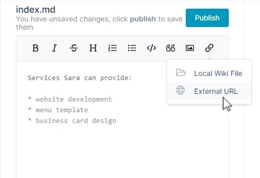

# Adding a Link to an External URL in a Wiki

You can add a link to an external URL in a wiki.

1.  [Open the wiki editor](/wiki/intro).
2.  In the center panel, click in the text editor in the location where you want to insert the link.
3.  Click the link icon in the toolbar in the center panel.
4.  Choose **External URL**.  
      
    The following link placeholder appears in the text editor:  
    
5.  Overwrite **My Link** with the text for your link.
6.  Overwrite **[https://airsend.io](https://airsend.io)** with your full link address including **https://** or **http://**
    The link placeholder and preview of the link appear as follows:  
    