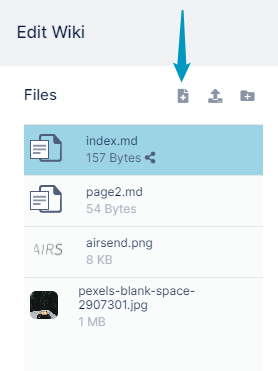
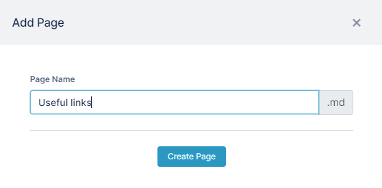
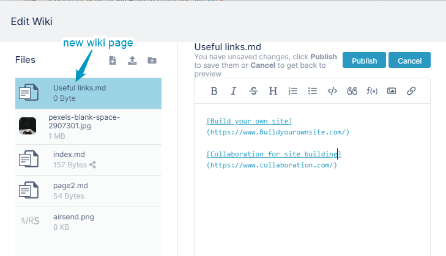
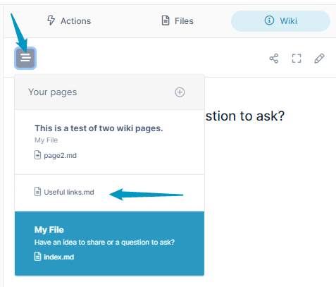

# Adding additional pages to the wiki

**To add an additional wiki page:**

1.  [Open the wiki editor](/wiki/intro).
    
2.  In the Files panel on the left of the Wiki editor, click the **Create a page** button.  
      
    An **Add Page** dialog box opens.   
    
3.  Enter a file name. The extension will always be **.md**.
4.  Click **Create Page**.  
    The file for the new page is listed in the Files panel, and is opened for edit in the central panel.
5.  Enter content into the new page.  
    
6.  Click **Publish**, and close the dialog box.
7.  Click the Wiki tab again.
8.  Click the icon in the upper left to view a clickable table of contents of all the pages in your wiki:  
    
9.  You may also want to [add links](/wiki/adding-a-link-to-a-file-in-a-wiki-page) on each page of your wiki to the others.