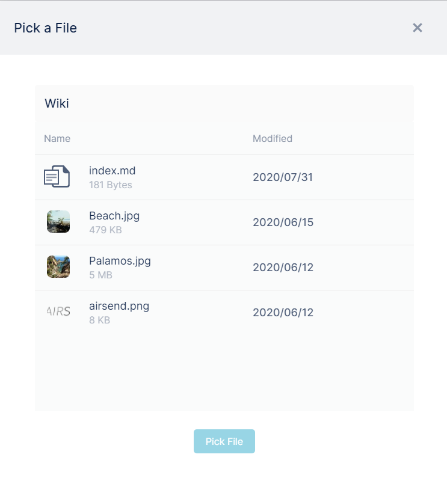
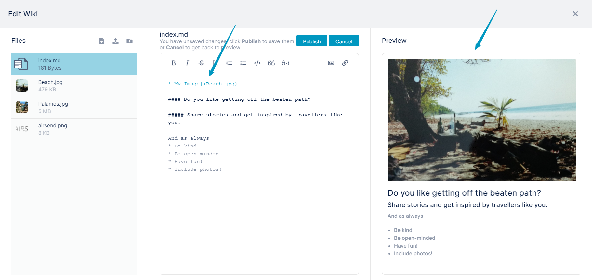

# Adding an image to a wiki page

You can add an image to a wiki page. The image must first be stored in the wiki by [uploading it to the wiki.](/wiki/uploading-files-or-folders-to-the-wiki)

1.  [Open the wiki editor](/wiki/intro).
2.  In the center panel, click the spot where you want to insert the image, and then click the image icon.  
      
      
    A Pick a File dialog box opens. It only shows images that have already been uploaded to the wiki.  
      
      
    
3.  Select the image file that you want to insert.
4.  Click **Pick File**.  
    The image file appears in the text editor in the format shown below.  
    You may change the text **My\_Image** to something more descriptive for a screen reader or for reference.  
    The Preview panel shows how the image will appear in the wiki.  
    