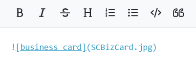

# Formatting wiki content

You can format the text you enter into the wiki editor using Markdown, a simple formatting language that lets you enhance plain text with styling such as italics, bold print, bullets and indents. 

In the following example, the wiki editor includes a list of services preceded by asterisks. In the preview panel the asterisks appeared as bullets, which is how they appear in the actual wiki. You can also use the shortcuts in the text editor's menu bar to insert Markdown.  

When you make changes in the Wiki editor, click **Publish** to save your changes before closing.

  
  
  
The following table shows Markdown symbols and the effect they have when the text is formatted in the wiki:

<table><colgroup><col><col><col></colgroup><tbody><tr><th>Markdown feature</th><th>In text editor</th><th>In wiki</th></tr><tr><td>
<strong>Bullets</strong> Asterisk followed by a space in front of a line is formatted as a bullet.

For each level of bullets, indent 5 spaces.
</td><td>

</td><td>

</td></tr><tr><td>
<strong>Numbered list</strong>

A number followed by a period and then a space in front of a line is formatted as a number in a list. It doesn't matter what numbers you use; Markdown displays the list with increments of 1.

For each level of numbers, indent 5 spaces.

 
</td><td>

</td><td>

</td></tr><tr><td>
<strong>Italics</strong>

When asterisks or underscores precede and follow text without spaces, the text is formatted as italics.&nbsp;
</td><td>

</td><td>

</td></tr><tr><td>
<strong>Bold</strong>

When double-asterisks or double-underscores precede and follow text without spaces, the text is formatted as bold.&nbsp;
</td><td>

</td><td>

</td></tr><tr><td>
<strong>Horizontal line</strong>

A line of three or more asterisks or three or more dashes in a row is formatted as a line the width of the wiki. This is a useful way to separate wiki entries.
</td><td>

</td><td>

</td></tr><tr><td><strong>Headers</strong> When pound signs followed by a space precede a line of text, the text is formatted as a headers. Up to 6 levels of headers are supported. The number of pound signs indicates the level of the header.&nbsp;</td><td>

</td><td>

</td></tr><tr><td>
<strong>Links</strong>

Text in brackets followed by a link address in parentheses is formatted as a link.
</td><td>

</td><td>

</td></tr><tr><td>
<strong>Images</strong>

An exclamation point, followed by text in brackets and an image link in parentheses is formatted as the image.
</td><td>

</td><td>

</td></tr><tr><td>
<strong>Quote</strong>

When a greater than sign precedes text, a vertical bar appears in front of the text and the text is indented to indicate that it is a quote.

To break out of a quote, you must enter a blank line after the final line of the quote.
</td><td>

</td><td>

</td></tr><tr><td><strong>Code  </strong>To enter code format (black background with white text), skip a row and indent 4 or more spaces.</td><td>

</td><td>

</td></tr></tbody></table>