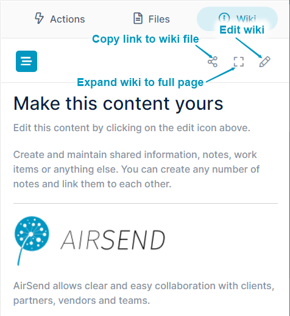
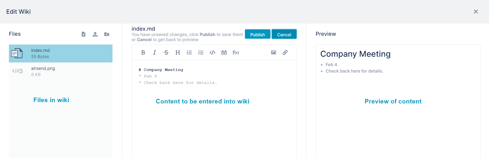
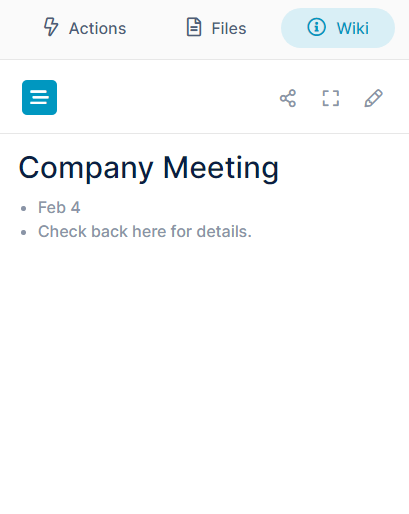

# Wiki: Displaying Important Information

The wiki in an AirSend channel is an easy to access place where you and the other members of the channel can enter important information, such as frequently accessed data, updates, or advertising information. 

Some ways to optimize the wiki area are:

-   When each channel represents a single client, post client name and address information for easy access
-   For schedule-based projects, display key dates or a calendar with deadlines
-   For public channels, enter posting instructions or display a post of the week
-   Include your logo, services, and contact information. This is especially useful if you are creating a channel template to use with multiple customers.

  

In the wiki, new content appears on top of the previous content without any formatting separating them. If you want to separate content or add other simple formatting, see [Formatting wiki content](/wiki/formatting-wiki-content).

  

To access the wiki after you open a channel, click the Wiki tab in the right panel. Before anything is added to the wiki, it appears as:  

Channel members with contributor access or higher can add content to wikis in non-public channels; channel members with full contributor access or higher can add content to wikis in public channels. 

**To add text to the wiki:**

1.  In the upper-right corner of the wiki, click the edit (pencil) icon.   
    An **Edit Wiki** page opens. It contains a panel displaying files in the channel, a panel for adding the wiki entry, and a panel for previewing the wiki entry (see the image below).
2.  Enter text into the text editor in the center panel. A preview of the text appears in the right panel.
3.  In the center panel, click **Publish**, and then close the wiki editor.  
      
    The content appears in the wiki:  
      