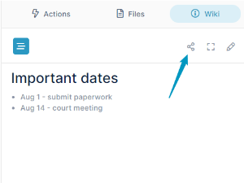

# Share Your Wiki Content

## To share the link to your wiki content

If you want to be sure that users see or remember the information in your wiki, you can share the link to your wiki file outside of AirSend.

1.  Click the Wiki tab in the right panel.
2.  Click the Share icon in the wiki toolbar.  
      
      
    A copy link dialog box opens:  
      
      
    
3.  Click **Copy Link**.
4.  Post the link on a web page or email it to users.  
      
    When a user clicks the link, a page for downloading the wiki file opens. The user does not have to have an AirSend account to download the file.  
    

## To delete the link to your wiki content

If you no longer want users to be able to access the content in the link, delete it.

1.  Follow the steps in the above procedure, but click **Delete Link** instead of **Copy Link**.  
    A dialog box enabling you to create a new link to the wiki file opens:  
      
      
    
2.  To create a new wiki link now, click **Create Link**.  
    If you do not create a new link now, when you click the wiki Share icon again, a new link will be generated for you.