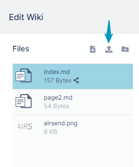
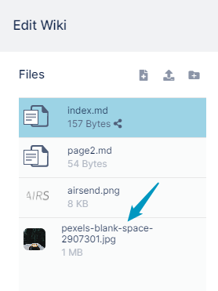

# Uploading files or folders to the wiki

To insert an image or file link into a page in a wiki, you must first upload the file or image to the wiki.  You can also upload a folder and its contents to the wiki.

**To upload a file or folder into the wiki:**

1.  [Open the wiki editor](/wiki/intro)   
    
2.  Drag and drop a file or folder onto the Files panel, or click the **Upload a file** button and upload a file or folder.  
      
      
    The file or folder appears in the Files panel:  
    

To add an uploaded image file to a page in the wiki, see [Adding an image to a wiki page](/wiki/adding-an-image-to-a-wiki-page).

To add a link to an uploaded file to a page in the wiki, see [Adding a link to a file in a wiki page](/wiki/adding-a-link-to-a-file-in-a-wiki-page).